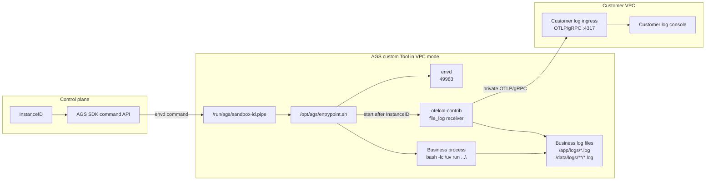

# Best Practice: Deliver AGS Sandbox Logs to a Customer-Owned Collector

## 1. Goal and scope

This document is for customers who already operate a self-managed logging system and want file-based application logs from AGS sandboxes to be delivered over the customer's VPC. It assumes the customer can expose an OTLP/gRPC endpoint such as `<collector-private-ip>:4317`.

For customers without a self-managed logging platform, Tencent Cloud CLS remains the recommended managed logging path. This document focuses on customers who need to keep their existing collection, storage, search, and audit pipeline.

The pattern does not change the application log format, does not capture stdout/stderr, and does not require the application to know about AGS. The application keeps writing its own log files. The wrapper and OpenTelemetry Collector only read configured files, attach runtime attributes, and export the records.

## 2. Solution summary

The flow has five steps:

1. Add `otelcol-contrib`, AGS `envd`, and a startup wrapper to the customer application image.
2. Create an AGS custom Tool in VPC mode so sandboxes can reach the private OTLP/gRPC endpoint.
3. AGS runs the wrapper. The wrapper starts envd and the application process, but does not start the collector yet.
4. After instance creation, the control plane writes the current `InstanceID` into a FIFO inside the sandbox through the envd-backed command API.
5. After receiving the current `InstanceID`, the wrapper renders collector config and starts collecting business log files.

This is snapshot-safe: do not bake `RUN_ID` or an old `InstanceID` into a snapshot. Every sandbox restored from the same snapshot must wait for current-instance identity injection before collecting logs.

The main roles in the rest of the document are:

- `AGS custom Tool`: the sandbox runtime specification, including image, startup command, ports, resources, and network settings.
- `envd`: the command-execution service inside the sandbox. AGS uses it to run commands in the sandbox.
- `wrapper`: the image entry script that starts envd, the application process, and the collector.
- `collector`: `otelcol-contrib`, which reads application log files and exports them over OTLP/gRPC.
- `control plane`: the customer or delivery automation environment that calls the AGS API and injects the current `InstanceID`.
- `allowlist`: the explicit list of environment variables that may be attached to log attributes.

## 3. Reference architecture



envd is a small command-execution service that runs inside the sandbox. AGS provides an envd-backed command channel, and the customer or delivery control plane calls that channel through the AGS SDK to run one-off commands. This pattern uses the channel to write the current `InstanceID` into the FIFO. The Tool therefore needs to expose the envd port, and the readiness probe should confirm envd is available before injection. See `scripts/inject_sandbox_id.sh` for the reference implementation.

In this document, "control plane" means the customer or delivery automation environment. It uses Tencent Cloud credentials to call the AGS API, obtains a sandbox token, and injects the current `InstanceID` into the target sandbox through envd.

## 4. Image integration

For an existing customer application image, add log delivery as an image layer instead of changing application code.

```dockerfile
FROM ccr.ccs.tencentyun.com/ags-image/envd:latest AS envd
FROM otel/opentelemetry-collector-contrib:<version> AS otelcol

FROM <customer-business-image>
COPY --from=envd /usr/bin/envd /usr/bin/envd
COPY --from=otelcol /otelcol-contrib /usr/local/bin/otelcol-contrib
COPY entrypoint.sh /opt/ags/entrypoint.sh
RUN chmod +x /usr/bin/envd /opt/ags/entrypoint.sh \
    && mkdir -p /run/ags /var/log/ags-collector /etc/otelcol
```

The reference implementation uses a Python service started by `bash -lc "uv run uvicorn ..."`. When adapting this pattern to a customer application, replace the application code and dependencies, update the startup command, service name, log paths, and business attributes in `.env.local`, and keep the wrapper's log collection behavior.

## 5. Tool startup

AGS custom Tools should not rely on the image `CMD` or `ENTRYPOINT`. Configure the Tool to execute the wrapper directly and pass the application command as arguments. This avoids nested shell quoting.

```json
{
  "Command": ["/opt/ags/entrypoint.sh"],
  "Args": [
    "bash",
    "-lc",
    "uv run uvicorn app.server:app --host 0.0.0.0 --port 8080"
  ]
}
```

The Tool must include the envd port. Business ports are optional and depend on the application.

```json
{
  "Ports": [
    {"Name": "envd", "Port": 49983, "Protocol": "TCP"},
    {"Name": "http", "Port": 8080, "Protocol": "TCP"}
  ],
  "Probe": {
    "HttpGet": {"Path": "/health", "Port": 49983, "Scheme": "HTTP"},
    "ReadyTimeoutMs": 30000,
    "ProbeTimeoutMs": 1000,
    "ProbePeriodMs": 3000,
    "SuccessThreshold": 1,
    "FailureThreshold": 10
  }
}
```

The readiness probe targets envd because identity injection depends on the command channel. Application health can remain inside the application or be checked separately by the customer's control plane.

## 6. Wrapper behavior

`entrypoint.sh` is responsible for:

1. Starting `/usr/bin/envd -port 49983`.
2. Starting the application command. The application writes file logs by itself.
3. Creating `/run/ags/sandbox-id.pipe` and waiting for the control plane to inject the current `InstanceID`.
4. Rendering collector config after the `InstanceID` is received.
5. Starting `otelcol-contrib` to read files matched by `LOG_FILE_PATTERNS`.
6. Preserving the business process exit code so collector or injection failure does not change business lifecycle semantics.

If identity injection never happens, the business continues to run, the collector does not start, and logs without current runtime identity are not exported.

## 7. Arbitrary log directories

The customer controls application log paths. The collector reads them through glob configuration.

```bash
LOG_FILE_PATTERNS="/app/logs/*.log,/data/customer/logs/**/*.log,/tmp/customer-logs/*.log"
LOG_EXCLUDE_FILE_PATTERNS="/var/log/ags-collector/*.log"
LOG_START_AT=beginning
```

`LOG_START_AT=beginning` lets the collector backfill logs written earlier in the current instance. In snapshot scenarios, if a directory may contain pre-snapshot history, use a per-instance log path or set `LOG_START_AT=end`.

## 8. Environment attributes

Do not export every environment variable. Explicitly allowlist the variables that should be attached to log resource attributes.

```bash
LOG_RESOURCE_ENV_KEYS="APP_ENV,CUSTOMER_ID,BUILD_ID,REGION"
```

The allowlist selects variable names only; it does not create variable values. The values must still be present in the Tool Env, for example through `EXTRA_ENV_JSON`. Here, `REGION` is a business log attribute, not the `TENCENTCLOUD_REGION` used when calling the AGS API.

The collector writes them as resource attributes such as:

- `env.app_env`
- `env.customer_id`
- `env.build_id`
- `env.region`

Each record also carries:

- `service.name`
- `service.instance.id`
- `ags.sandbox.id`
- `deployment.environment.name`

This reference implementation uses the AGS `InstanceID` as the current sandbox runtime identity and writes it to both `service.instance.id` and `ags.sandbox.id`. Whether these attributes become queryable labels depends on the customer's OTel/Loki/ES mapping. If Loki is used for validation, these fields are typically visible in stream metadata; whether they are indexed as labels depends on the backend mapping.

## 9. Image build and pre-cache

Build the image in the customer's CI/CD system or on a controlled build host. The reference script packages `images/sandbox`, sends it to a remote host, and runs Docker build/push.

```bash
export REMOTE_BUILD_HOST=root@<build-host>
export REMOTE_BUILD_PORT=22
export IMAGE=<registry>/<namespace>/<repo>:<tag>

scripts/build_sandbox_remote.sh
```

After the image is built, put the same image URI into `AGS_IMAGE` in `.env.local`. Pre-cache the image before starting instances to reduce cold-start latency:

```bash
agr pre-cache-image-task create \
  --image "$IMAGE" \
  --image-registry-type "$AGS_IMAGE_REGISTRY_TYPE" \
  -o json
```

## 10. Create the Tool

Prepare variables:

```bash
cp iac/variables.example.env .env.local
# Edit .env.local. At minimum, fill AGS_IMAGE, AGS_SUBNET_ID,
# AGS_SECURITY_GROUP_ID, OTLP_ENDPOINT, SERVICE_NAME, and BUSINESS_COMMAND.
# Also confirm EXTRA_ENV_JSON matches LOG_RESOURCE_ENV_KEYS.
set -a
source .env.local
set +a
```

`OTLP_ENDPOINT` in `.env.local` is written by the generation script into the Tool Env as `OTEL_EXPORTER_OTLP_ENDPOINT`. The wrapper and collector read the Tool Env value.

Generate and review the request:

```bash
DRY_RUN=true scripts/create_ags_tool.sh > ags-tool.generated.json
jq . ags-tool.generated.json
```

Create the Tool:

```bash
agr tool create --request @ags-tool.generated.json -o json
```

Required variables include the image, VPC subnet, security group, OTLP/gRPC endpoint, application startup command, service name, and log paths. These values decide how the sandbox starts and where the collector exports logs.

Cloud resource permission is optional. If the image registry or storage mounts require cloud access, configure the corresponding `RoleArn`. If this access is not needed, leave `AGS_ROLE_ARN` empty and the reference script omits the field.

Tags are optional as well. If the account has tag-governance rules, use only allowed tag keys. The reference script emits `purpose` by default and emits `billing` when billing allocation is needed.

Environment attributes are configured in two steps. `LOG_RESOURCE_ENV_KEYS` only declares which environment variables are allowed to become log resource attributes. It does not create those variables. The variables themselves must also exist in the Tool Env.

The reference script uses `EXTRA_ENV_JSON` to append application variables such as `APP_ENV`, `CUSTOMER_ID`, `BUILD_ID`, and `REGION` to the Tool Env. Do not submit `iac/ags-tool.template.json` directly; it is a shape-only template for human review of the request structure. For production submission, use the `ags-tool.generated.json` produced by `scripts/create_ags_tool.sh`; the script omits empty `RoleArn` and empty tag fields automatically.

## 11. Start an instance and inject InstanceID

Start an instance:

```bash
instance_id=$(agr instance create \
  --tool-id <tool-id> \
  --timeout 30m \
  -o json --jq '.Data.InstanceId')
```

The injection script calls the AGS API to acquire a sandbox token, then enters the sandbox through the envd command API. Run this script from the customer's control plane or delivery pipeline, not from inside the sandbox. The environment running the script needs Tencent Cloud credentials and region configuration that can call the AGS API:

```bash
export TENCENTCLOUD_SECRET_ID=<secret-id>
export TENCENTCLOUD_SECRET_KEY=<secret-key>
export TENCENTCLOUD_REGION=ap-guangzhou
# If temporary credentials are used, also set TENCENTCLOUD_TOKEN.
```

The identity needs permission to read/connect to the target sandbox instance, including acquiring a sandbox token and accessing the instance data-plane command channel.

Inject the current instance ID:

```bash
INSTANCE_ID="$instance_id" scripts/inject_sandbox_id.sh
```

`scripts/inject_sandbox_id.sh` uses the AGS Go SDK to connect to the envd command API and executes this command inside the sandbox:

```bash
printf '%s\n' "$INSTANCE_ID" > /run/ags/sandbox-id.pipe
```

The wrapper starts the collector only after this injection succeeds.

## 12. Validation

A complete validation should cover:

1. The Tool is `ACTIVE`, and an instance reaches `RUNNING`.
2. Before injection, the business is running and the collector is not started.
3. After injection, collector logs show `Everything is ready` and it starts watching files from `LOG_FILE_PATTERNS`.
4. The customer logging system receives business logs with `service.name`, `service.instance.id`, `ags.sandbox.id`, and allowlisted environment attributes.
5. Logs from arbitrary directories, for example `/tmp/customer-logs/custom.log`, are collected.
6. If injection fails, the business continues to run and the collector does not start.

For Loki, first query by a stable indexed field:

```logql
{service_name="<service-name>"} |= "custom_dir_log"
```

Then confirm the returned stream metadata contains:

```text
ags_sandbox_id="<instance-id>"
env_customer_id="<customer-id>"
env_build_id="<build-id>"
log_file_path="/tmp/customer-logs/custom.log"
```

If the customer wants to use `ags_sandbox_id` or `env_customer_id` directly in selectors, configure the logging backend to index/map those attributes as labels.

## 13. Production guidance

- Enable OTLP/gRPC TLS, authentication, quotas, and alerting in production.
- Do not bake `RUN_ID`, old `InstanceID`, or other runtime identity into snapshots.
- Business log directories are customer-controlled. The collector reads configured globs and does not modify log content or format.
- Use an allowlist for environment variables to avoid exporting tokens, secrets, or connection strings.
- Change AGS Tool network mode by creating or forking a Tool, not by mutating an existing production Tool in place.
