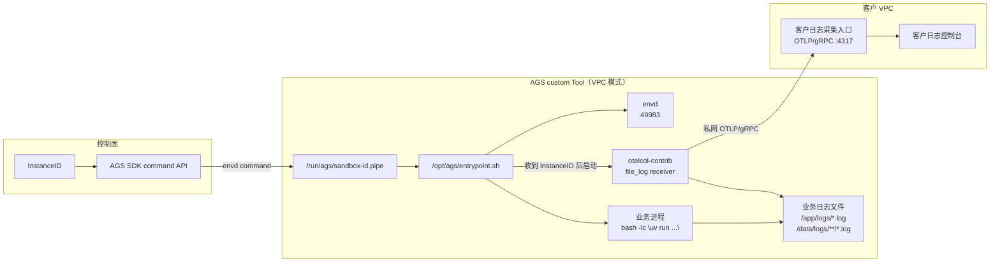

# AGS 沙箱日志投递到客户自建采集系统最佳实践

## 1. 目标和边界

本文面向已经运行自建日志系统的客户，说明如何把 AGS 沙箱内的业务文件日志投递到客户侧采集系统。投递链路走客户 VPC 内网，客户侧需要提供 OTLP/gRPC 入口，例如 `<collector-private-ip>:4317`。

如果客户没有自建日志系统，托管化路径仍建议优先接入腾讯云 CLS。本文聚焦“继续使用客户自建采集、存储、检索和审计链路”的场景。

本方案不修改业务日志格式，不接管 stdout/stderr，也不要求业务感知 AGS。业务仍然写自己的日志文件；镜像里的 wrapper 和 OpenTelemetry Collector 只负责读取指定文件、附加运行时属性并上报。

## 2. 方案摘要

整体流程分为五步：

1. 在客户业务镜像中加入 `otelcol-contrib`、AGS `envd` 和一个启动 wrapper。
2. AGS custom Tool 使用 VPC 网络模式，连通客户 VPC 内的 OTLP/gRPC endpoint。
3. AGS 执行 wrapper；wrapper 先启动 envd 和业务进程，collector 暂不启动。
4. 控制面创建实例后，通过基于 envd 的 command API 把本次 `InstanceID` 写入沙箱内 FIFO。
5. wrapper 收到本次 `InstanceID` 后渲染 collector 配置并开始采集业务日志文件。

这个设计专门处理快照启动：快照里不能固化 `RUN_ID` 或旧 `InstanceID`。每个从同一快照恢复出来的沙箱，都必须等待控制面注入本次真实 `InstanceID` 后再开始采集。

后文使用的几个角色如下：

- `AGS custom Tool`：AGS 沙箱的运行规格，包含镜像、启动命令、端口、资源和网络配置。
- `envd`：运行在沙箱内的命令执行服务，AGS 通过它提供进入沙箱的 command 通道。
- `wrapper`：镜像入口脚本，负责启动 envd、业务进程和 collector。
- `collector`：`otelcol-contrib`，读取业务日志文件并通过 OTLP/gRPC 上报。
- `控制面`：客户或服务商的自动化执行环境，负责调用 AGS API 并注入本次 `InstanceID`。
- `allowlist`：允许附加到日志属性中的环境变量名单。

## 3. 参考架构



envd 是运行在沙箱内的小型命令执行服务。AGS 提供基于 envd 的 command 通道；客户或服务商控制面通过 AGS SDK 调用该通道执行一次性命令。本文用这个通道把当前 `InstanceID` 写入 FIFO。因此 Tool 需要暴露 envd 端口，且就绪探针需要先确认 envd 可用。仓库里的 `scripts/inject_sandbox_id.sh` 已按该方式实现。

本文中的“控制面”指客户或服务商的自动化执行环境。它使用腾讯云凭证调用 AGS API，获取 sandbox token，并通过 envd 向目标沙箱注入本次 `InstanceID`。

## 4. 镜像集成

客户已有业务镜像时，推荐把采集能力作为镜像构建的一层加入，而不是改业务代码。

```dockerfile
FROM ccr.ccs.tencentyun.com/ags-image/envd:latest AS envd
FROM otel/opentelemetry-collector-contrib:<version> AS otelcol

FROM <customer-business-image>
COPY --from=envd /usr/bin/envd /usr/bin/envd
COPY --from=otelcol /otelcol-contrib /usr/local/bin/otelcol-contrib
COPY entrypoint.sh /opt/ags/entrypoint.sh
RUN chmod +x /usr/bin/envd /opt/ags/entrypoint.sh \
    && mkdir -p /run/ags /var/log/ags-collector /etc/otelcol
```

参考实现中，业务进程是 `bash -lc "uv run uvicorn ..."` 启动的 Python 服务。客户交付时替换业务代码和依赖，并同步更新 `.env.local` 中的启动命令、服务名、日志路径和业务属性，保留 wrapper 的日志采集逻辑。

## 5. Tool 启动方式

AGS custom Tool 不依赖镜像内的 `CMD` 或 `ENTRYPOINT`，需要在 Tool 配置中显式填写启动命令。推荐让 AGS 直接执行 wrapper，并把业务命令作为参数传入，避免多层 shell 引号。

```json
{
  "Command": ["/opt/ags/entrypoint.sh"],
  "Args": [
    "bash",
    "-lc",
    "uv run uvicorn app.server:app --host 0.0.0.0 --port 8080"
  ]
}
```

Tool 端口至少包含 envd 端口。业务端口是否暴露由客户业务决定。

```json
{
  "Ports": [
    {"Name": "envd", "Port": 49983, "Protocol": "TCP"},
    {"Name": "http", "Port": 8080, "Protocol": "TCP"}
  ],
  "Probe": {
    "HttpGet": {"Path": "/health", "Port": 49983, "Scheme": "HTTP"},
    "ReadyTimeoutMs": 30000,
    "ProbeTimeoutMs": 1000,
    "ProbePeriodMs": 3000,
    "SuccessThreshold": 1,
    "FailureThreshold": 10
  }
}
```

这里把 envd 作为就绪探针，是因为后续身份注入依赖 envd command 通道。业务自身健康检查可以保留在业务内部或由客户侧控制面单独检查。

## 6. wrapper 行为

`entrypoint.sh` 的职责如下：

1. 启动 `/usr/bin/envd -port 49983`。
2. 启动客户业务命令，业务自行写文件日志。
3. 创建 `/run/ags/sandbox-id.pipe` 并等待控制面注入本次 `InstanceID`。
4. 注入成功后生成 collector 配置。
5. 启动 `otelcol-contrib`，读取 `LOG_FILE_PATTERNS` 匹配的业务日志。
6. 保留业务进程退出码；collector 或注入失败不改变业务生命周期。

如果身份注入没有发生，业务继续运行，collector 不启动，也不会把缺少本次身份的日志上报出去。

## 7. 任意目录日志采集

客户控制业务写入路径，采集器通过 glob 配置读取任意目录。

```bash
LOG_FILE_PATTERNS="/app/logs/*.log,/data/customer/logs/**/*.log,/tmp/customer-logs/*.log"
LOG_EXCLUDE_FILE_PATTERNS="/var/log/ags-collector/*.log"
LOG_START_AT=beginning
```

`LOG_START_AT=beginning` 可以在 collector 启动后补采本次实例中已经写入的日志。快照场景下，如果日志目录可能包含快照前历史内容，建议使用每次实例启动都会重新生成的目录，或将 `LOG_START_AT` 设置为 `end`。

## 8. 环境变量属性

不要默认上报全部环境变量。通过 allowlist 显式选择需要附加到日志资源属性中的变量：

```bash
LOG_RESOURCE_ENV_KEYS="APP_ENV,CUSTOMER_ID,BUILD_ID,REGION"
```

allowlist 只选择变量名，不会自动创建变量值。变量值仍需通过 Tool Env 提供，例如由 `EXTRA_ENV_JSON` 注入。这里的 `REGION` 是业务日志属性，不是调用 AGS API 时使用的 `TENCENTCLOUD_REGION`。

collector 会把这些变量写成资源属性，例如：

- `env.app_env`
- `env.customer_id`
- `env.build_id`
- `env.region`

同时每条日志会包含：

- `service.name`
- `service.instance.id`
- `ags.sandbox.id`
- `deployment.environment.name`

本参考实现使用 AGS `InstanceID` 作为本次沙箱运行身份，并同时写入 `service.instance.id` 和 `ags.sandbox.id`。是否把这些属性建成可检索 label，取决于客户日志后端的 OTel/Loki/ES 映射配置。如果使用 Loki 验证，通常可以在 stream 元数据中看到这些字段；是否进入 label 索引取决于后端映射。

## 9. 镜像构建和预热

镜像可以在客户 CI/CD 或受控构建机上完成。参考脚本会把 `images/sandbox` 发送到远端构建机并执行 Docker build/push。

```bash
export REMOTE_BUILD_HOST=root@<build-host>
export REMOTE_BUILD_PORT=22
export IMAGE=<registry>/<namespace>/<repo>:<tag>

scripts/build_sandbox_remote.sh
```

构建完成后，把同一个镜像地址填入 `.env.local` 的 `AGS_IMAGE`。启动实例前建议做镜像预热：

```bash
agr pre-cache-image-task create \
  --image "$IMAGE" \
  --image-registry-type "$AGS_IMAGE_REGISTRY_TYPE" \
  -o json
```

## 10. 创建 Tool

准备变量：

```bash
cp iac/variables.example.env .env.local
# 编辑 .env.local，至少填写 AGS_IMAGE、AGS_SUBNET_ID、AGS_SECURITY_GROUP_ID、
# OTLP_ENDPOINT、SERVICE_NAME、BUSINESS_COMMAND，并确认 EXTRA_ENV_JSON
# 与 LOG_RESOURCE_ENV_KEYS 对齐。
set -a
source .env.local
set +a
```

`.env.local` 中的 `OTLP_ENDPOINT` 会由生成脚本写成 Tool Env `OTEL_EXPORTER_OTLP_ENDPOINT`，wrapper 和 collector 实际读取后者。

生成并评审请求：

```bash
DRY_RUN=true scripts/create_ags_tool.sh > ags-tool.generated.json
jq . ags-tool.generated.json
```

创建 Tool：

```bash
agr tool create --request @ags-tool.generated.json -o json
```

必填变量包括镜像、VPC 子网、安全组、OTLP/gRPC endpoint、业务启动命令、服务名和日志路径。它们决定沙箱如何启动，以及 collector 把日志投递到哪里。

云资源权限是可选项。镜像仓库或挂载存储需要云资源访问时，Tool 必须配置对应的 `RoleArn`；如果不需要这类访问，保持 `AGS_ROLE_ARN` 为空，参考脚本会自动省略该字段。

标签也是可选项。如果账号内对标签键有治理规则，只使用已允许的标签键。参考脚本默认输出 `purpose`，并在需要计费归集时输出 `billing`。

环境变量属性分为两步配置。`LOG_RESOURCE_ENV_KEYS` 只表示允许哪些环境变量进入日志资源属性；它不会自动创建这些变量。变量本身也必须存在于 Tool Env 中。

参考脚本通过 `EXTRA_ENV_JSON` 把 `APP_ENV`、`CUSTOMER_ID`、`BUILD_ID`、`REGION` 等业务环境变量追加到 Tool Env。不要直接提交 `iac/ags-tool.template.json`；它只是 shape-only 模板，用于人工评审请求结构。生产提交建议以 `scripts/create_ags_tool.sh` 生成的 `ags-tool.generated.json` 为准，脚本会自动省略空 `RoleArn` 和空标签。

## 11. 启动实例并注入 InstanceID

启动实例：

```bash
instance_id=$(agr instance create \
  --tool-id <tool-id> \
  --timeout 30m \
  -o json --jq '.Data.InstanceId')
```

注入脚本需要调用 AGS API 获取 sandbox token，并通过 envd command API 进入沙箱。因此，运行脚本的位置属于“客户控制面”或交付流水线，而不是沙箱内部。运行脚本的环境需要具备可调用 AGS API 的腾讯云凭证和区域配置：

```bash
export TENCENTCLOUD_SECRET_ID=<secret-id>
export TENCENTCLOUD_SECRET_KEY=<secret-key>
export TENCENTCLOUD_REGION=ap-guangzhou
# 如果使用临时密钥，再设置 TENCENTCLOUD_TOKEN
```

该身份至少需要读取/连接目标沙箱实例的权限，例如获取 sandbox token 和访问对应实例的数据面命令通道。

注入本次实例 ID：

```bash
INSTANCE_ID="$instance_id" scripts/inject_sandbox_id.sh
```

`scripts/inject_sandbox_id.sh` 使用 AGS Go SDK 连接 envd command API，并在沙箱内执行：

```bash
printf '%s\n' "$INSTANCE_ID" > /run/ags/sandbox-id.pipe
```

注入成功后，wrapper 才会启动 collector。

## 12. 验收方式

一次完整验收应覆盖：

1. Tool 状态为 `ACTIVE`，实例可以进入 `RUNNING`。
2. 注入前业务正常运行，collector 不启动。
3. 注入后 collector 日志出现 `Everything is ready`，并开始 watch `LOG_FILE_PATTERNS` 中的文件。
4. 客户日志系统能看到业务日志，且 stream/record 中包含 `service.name`、`service.instance.id`、`ags.sandbox.id` 和 allowlist 环境变量属性。
5. 任意目录日志可以被采集，例如 `/tmp/customer-logs/custom.log`。
6. 注入失败时，业务继续运行，collector 不启动。

以 Loki 为例，先用稳定索引字段查询服务日志：

```logql
{service_name="<service-name>"} |= "custom_dir_log"
```

然后在返回的 stream 元数据中确认：

```text
ags_sandbox_id="<instance-id>"
env_customer_id="<customer-id>"
env_build_id="<build-id>"
log_file_path="/tmp/customer-logs/custom.log"
```

如果客户希望直接用 `ags_sandbox_id` 或 `env_customer_id` 做 selector，需要在日志后端配置对应属性的索引/label 映射。

## 13. 生产化建议

- 生产环境建议启用 OTLP/gRPC TLS、鉴权、配额和告警。
- 快照场景下不要固化 `RUN_ID`、旧 `InstanceID` 或其他运行时身份。
- 业务日志目录由客户控制，采集器只读取配置的 glob，不改变日志内容和格式。
- 对环境变量使用 allowlist，避免 token、密钥、连接串进入日志系统。
- AGS Tool 的网络模式建议通过新建或 fork Tool 变更，不在生产 Tool 上原地切换。
