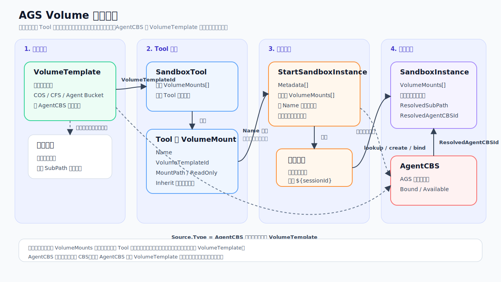

# AGS Volume API 变更说明

本文面向需要评估 AGS Volume 首期能力的客户，重点说明新增 API、现有 API 的字段变化、请求/响应语义和首期范围。示例使用 OpenAPI/JSON 风格表达字段，不绑定某个语言实现。

## 1. 设计结论

AGS Volume 首期不是简单新增一个挂载参数，而是把 AGS 使用存储的声明、资源归属和实例最终挂载结果显式化。

核心变化：

- 新增 `VolumeTemplate` 资源，用来声明 AGS 可使用的一份存储能力。
- 新增 AGS 托管的 `AgentCBS` 数据盘实例，由 AgentCBS 类型 `VolumeTemplate` 自动派生。
- `CreateSandboxTool` 是已有 API，本次新增 `VolumeMounts[]` 字段，用于让 Tool 绑定可使用的 `VolumeTemplate`。
- `StartSandboxInstance` 是已有 API，不新增 `CreateSandboxInstance`；实例启动时继续使用已有 `Metadata[]` 和 `MountOptions[]`。
- 实例启动时不能直接引用新的 `VolumeTemplate`，只能覆盖或启用 Tool 已声明的同名挂载。
- `DescribeSandboxInstance` / `DescribeSandboxInstanceList` 返回实例最终挂载结果，客户可以看到最终 `ResolvedSubPath` 或 `ResolvedAgentCBSId`。

首期不支持：

- 不接管客户已有 CBS 数据盘。
- 不开放通用 CBS 接入，只支持 AGS AgentCBS。
- 不支持启动实例时追加 Tool 未声明的新存储。
- 不支持实例启动后动态追加或卸载存储。
- 不支持除 `${sessionId}` 之外的模板变量。
- `VolumeTemplate.SourceType` 首期只支持 `Cos` / `Cfs` / `AgentBucket` / `AgentCBS`。
- 实例最终挂载结果只作为实例视图返回，不作为独立云资源。

## 2. 实体关系



| 实体 | 是否云资源 | 作用 |
|------|------------|------|
| `VolumeTemplate` | 是 | 存储声明资源；也是 tag 和资源归属单位 |
| `VolumeMount` | 否 | Tool 对 `VolumeTemplate` 的使用声明，保存在 Tool 配置中 |
| `MountOption` | 否 | `StartSandboxInstance` 已有实例级覆盖字段，按 `Name` 覆盖或启用 Tool 声明的挂载 |
| `SandboxInstance.VolumeMounts[]` | 否 | 实例最终挂载结果视图，依附于实例，不是独立资源 |
| `AgentCBS` | 否 | AGS 托管数据盘，有状态和绑定关系，归属于所属 `VolumeTemplate` |

## 3. API 变更总览

### 3.1 新增 API

| API | 说明 |
|-----|------|
| `CreateVolumeTemplate` | 创建存储声明资源 |
| `DescribeVolumeTemplates` | 查询存储声明资源 |
| `DeleteVolumeTemplate` | 删除未被 Tool 引用且无存活 AgentCBS 的存储声明 |
| `DescribeAgentCBS` | 查询 AGS 派生的数据盘 |
| `DeleteAgentCBS` | 删除空闲 AgentCBS |

### 3.2 调整现有 API

| API | 变化 |
|-----|------|
| `CreateSandboxTool` | 新增 `VolumeMounts[]`，声明 Tool 可使用哪些 `VolumeTemplate` |
| `DescribeSandboxTool` / `DescribeSandboxToolList` | 对新 Tool 返回 `VolumeMounts[]` |
| `StartSandboxInstance` | 复用已有 `Metadata[]` 做模板渲染；复用已有 `MountOptions[]` 覆盖或启用 Tool 已声明挂载 |
| `DescribeSandboxInstance` / `DescribeSandboxInstanceList` | 返回最终实际挂载结果 `VolumeMounts[]` |

### 3.3 与旧字段的关系

| 旧链路字段 | 新链路关系 |
|------------|------------|
| `StorageMounts[]` | 旧 Tool 继续使用；新 Tool 使用 `VolumeMounts[]` |
| `MountOptions[]` | 继续作为实例级覆盖字段；旧 Tool 覆盖 `StorageMounts[]`，新 Tool 覆盖 `VolumeMounts[]` |
| 实例最终挂载视图 | 新实例通过 `DescribeSandboxInstance` / `DescribeSandboxInstanceList` 的 `VolumeMounts[]` 查看最终结果 |

首期同一个 Tool 不允许同时使用 `StorageMounts[]` 和 `VolumeMounts[]`。因此 `StartSandboxInstance.MountOptions[]` 的匹配目标是确定的：旧 Tool 匹配 `StorageMounts[].Name`，新 Tool 匹配 `VolumeMounts[].Name`。

## 4. 新增 API

### 4.1 CreateVolumeTemplate

创建一份 AGS 可使用的存储声明资源。

请求字段：

| 字段 | 类型 | 必填 | 说明 |
|------|------|------|------|
| `VolumeTemplateName` | string | 是 | 客户自定义名称，同一租户内唯一 |
| `Description` | string | 否 | 描述 |
| `Tags` | `Tag[]` | 否 | 云资源 tag，用于团队、项目、环境、成本归属 |
| `SourceType` | string | 是 | `Cos` / `Cfs` / `AgentBucket` / `AgentCBS` |
| `Source` | object | 是 | 存储源配置；不同 `SourceType` 结构不同 |
| `SubPathTemplate` | string | 否 | 共享介质子路径模板，首期只支持 `${sessionId}` |
| `NameTemplate` | string | AgentCBS 可选 | AgentCBS 名称模板，例如 `agent-${sessionId}`；不传表示每次启动生成唯一盘名 |
| `DefaultCapacity` | string | AgentCBS 必填 | AgentCBS 默认容量，例如 `20Gi` |
| `DiskType` | string | AgentCBS 必填 | AgentCBS 盘型，例如 `CLOUD_SSD` |
| `ReclaimPolicy` | string | 是 | `Retain` / `Delete`；共享介质首期只允许 `Retain` |

`Source` 结构：

| `SourceType` | `Source` 字段 | 必填字段 | 说明 |
|--------------|----------------|----------|------|
| `Cos` | `Cos` | `BucketName`、`BucketPath` | `BucketPath` 是允许 AGS 使用的桶内基础路径 |
| `Cfs` | `Cfs` | `FileSystemId`、`Path` | `Path` 是允许 AGS 使用的文件系统基础路径 |
| `AgentBucket` | `AgentBucket` | `AccessDomain` | 可选 `SpaceId`；用于声明 Agent Bucket 空间范围 |
| `AgentCBS` | `AgentCBS` | 无 | 不接收客户已有 CBS `DiskId`，由 AGS 按模板派生数据盘 |

`Cos` source：

```json
{
  "Cos": {
    "BucketName": "agent-workspaces",
    "BucketPath": "/sessions"
  }
}
```

`Cfs` source：

```json
{
  "Cfs": {
    "FileSystemId": "cfs-xxxxxxxx",
    "Path": "/datasets/team-a"
  }
}
```

`AgentBucket` source：

```json
{
  "AgentBucket": {
    "AccessDomain": "example.smh.tencent-cloud.com",
    "SpaceId": "team-a"
  }
}
```

`AgentCBS` source：

```json
{
  "AgentCBS": {}
}
```

请求示例：共享 COS 会话目录

```json
{
  "VolumeTemplateName": "session-workspace",
  "Description": "workspace split by sessionId",
  "Tags": [
    {"Key": "team", "Value": "team-a"},
    {"Key": "env", "Value": "prod"}
  ],
  "SourceType": "Cos",
  "Source": {
    "Cos": {
      "BucketName": "agent-workspaces",
      "BucketPath": "/sessions"
    }
  },
  "SubPathTemplate": "${sessionId}",
  "ReclaimPolicy": "Retain"
}
```

请求示例：AgentCBS 会话复用盘

```json
{
  "VolumeTemplateName": "session-agent-cbs",
  "SourceType": "AgentCBS",
  "Source": {
    "AgentCBS": {}
  },
  "DefaultCapacity": "20Gi",
  "DiskType": "CLOUD_SSD",
  "NameTemplate": "agent-${sessionId}",
  "ReclaimPolicy": "Retain"
}
```

响应字段：

| 字段 | 说明 |
|------|------|
| `VolumeTemplateId` | 系统生成的资源 ID |
| `Status` | 初始为 `Active` |
| `CreateTime` | 创建时间 |
| `VolumeTemplate` | 创建后的完整资源视图 |

响应示例：

```json
{
  "VolumeTemplate": {
    "VolumeTemplateId": "vt-xxxxxxxx",
    "VolumeTemplateName": "session-workspace",
    "SourceType": "Cos",
    "Status": "Active",
    "SubPathTemplate": "${sessionId}",
    "ReclaimPolicy": "Retain",
    "Tags": [
      {"Key": "team", "Value": "team-a"}
    ],
    "CreateTime": "2026-06-18T10:00:00Z"
  }
}
```

关键校验：

- `VolumeTemplateName` 同一租户内唯一。
- `SourceType=AgentCBS` 时，必须填写 `DefaultCapacity` 和 `DiskType`。
- AgentCBS 不允许传入客户已有 CBS `DiskId`。
- 共享介质必须填写客户已有介质范围，例如 COS bucket/path、CFS filesystem/path、Agent Bucket domain/space。
- 共享介质不允许 `ReclaimPolicy=Delete`。
- `SubPathTemplate` 和 `NameTemplate` 首期只允许使用字面量 `${sessionId}`。

### 4.2 DescribeVolumeTemplates

查询 `VolumeTemplate` 资源。

请求字段：

| 字段 | 说明 |
|------|------|
| `VolumeTemplateIds` | 按 ID 批量查询 |
| `VolumeTemplateName` | 按名称查询 |
| `SourceType` | 按 `Cos` / `Cfs` / `AgentBucket` / `AgentCBS` 过滤 |
| `Status` | 按状态过滤 |
| `Tags` | 按 tag 过滤 |
| `Offset` / `Limit` | 分页 |

响应字段：

| 字段 | 说明 |
|------|------|
| `TotalCount` | 总数 |
| `VolumeTemplates[]` | 模板列表 |

响应结构：

```json
{
  "TotalCount": 1,
  "VolumeTemplates": [
    {
      "VolumeTemplateId": "vt-xxxxxxxx",
      "VolumeTemplateName": "session-workspace",
      "SourceType": "Cos",
      "Status": "Active",
      "SubPathTemplate": "${sessionId}",
      "ReclaimPolicy": "Retain"
    }
  ]
}
```

`DescribeVolumeTemplates` 返回的是安全视图。密钥、token、临时凭证等敏感字段不应原样返回；返回内容只需要让客户识别存储范围，例如 bucket/path、filesystem/path、Agent Bucket domain/space。

### 4.3 DeleteVolumeTemplate

删除 `VolumeTemplate` 声明资源。

请求字段：

| 字段 | 必填 | 说明 |
|------|------|------|
| `VolumeTemplateId` | 是 | 要删除的模板 ID |

删除说明：

- 该 API 删除的是 AGS 侧 `VolumeTemplate` 声明。
- 共享介质类型模板删除后，不删除客户底层 COS / CFS / Agent Bucket 资源，也不删除其中的数据。
- 如果模板仍被 Tool 或 AgentCBS 使用，需要先解除相关引用或释放相关资源。

### 4.4 DescribeAgentCBS

查询 AGS 派生的数据盘。

请求字段：

| 字段 | 说明 |
|------|------|
| `AgentCBSIds` | 按 AgentCBS ID 查询 |
| `VolumeTemplateId` | 查询某个模板派生的 AgentCBS |
| `Status` | AgentCBS 当前状态，例如空闲、绑定中、删除中等，枚举以正式 API 为准 |
| `BoundInstanceId` | 查询绑定到某个实例的数据盘 |
| `Offset` / `Limit` | 分页 |

响应字段：

| 字段 | 说明 |
|------|------|
| `TotalCount` | 总数 |
| `AgentCBSSet[]` | AgentCBS 列表 |

`AgentCBSSet[]` 中每个对象包含：

| 字段 | 说明 |
|------|------|
| `AgentCBSId` | AGS 托管数据盘 ID，不是客户已有 CBS `DiskId` |
| `VolumeTemplateId` | 所属模板 |
| `Name` | 渲染后的名称或系统生成名 |
| `Status` | 当前状态 |
| `BoundInstanceId` | 当前绑定实例，空表示未绑定 |
| `Capacity` | 容量 |
| `DiskType` | 盘型 |
| `CreateTime` | 创建时间 |

响应结构：

```json
{
  "TotalCount": 1,
  "AgentCBSSet": [
    {
      "AgentCBSId": "acbs-xxxxxxxx",
      "VolumeTemplateId": "vt-yyyyyyyy",
      "Name": "agent-sess-001",
      "Status": "Available",
      "Capacity": "20Gi",
      "DiskType": "CLOUD_SSD",
      "CreateTime": "2026-06-18T10:00:00Z"
    }
  ]
}
```

归属规则：

- AgentCBS 归属于所属 `VolumeTemplate`。
- AgentCBS 不单独打 tag，相关查询、管理和成本归属按 `VolumeTemplateId` 关联。

### 4.5 DeleteAgentCBS

删除空闲 AgentCBS。

请求字段：

| 字段 | 必填 | 说明 |
|------|------|------|
| `AgentCBSId` | 是 | 要删除的 AgentCBS ID |

删除说明：

- 该 API 用于释放不再使用的 AGS 托管 AgentCBS。
- 已绑定实例的 AgentCBS 需要先停止或释放对应实例，再执行删除。
- 具体状态枚举和幂等语义以正式 API 定义为准。

## 5. 现有 API 调整

### 5.1 CreateSandboxTool 新增 VolumeMounts

`CreateSandboxTool` 是已有 API。本次新增 `VolumeMounts[]` 字段，让 Tool 明确声明自己可以使用哪些 `VolumeTemplate`。

请求新增字段：

```json
{
  "ToolName": "code-interpreter",
  "ToolType": "custom",
  "VolumeMounts": [
    {
      "Name": "workspace",
      "VolumeTemplateId": "vt-xxxxxxxx",
      "MountPath": "/workspace",
      "ReadOnly": false,
      "Inherit": true
    }
  ]
}
```

`VolumeMount` 字段：

| 字段 | 必填 | 说明 |
|------|------|------|
| `Name` | 是 | Tool 内唯一；实例级 `MountOptions[]` 按该字段匹配 |
| `VolumeTemplateId` | 是 | 引用的模板 ID |
| `MountPath` | 是 | 容器内默认挂载路径 |
| `ReadOnly` | 否 | 默认是否只读 |
| `SubPath` | 否 | 共享介质默认子路径；AgentCBS 禁止填写 |
| `Inherit` | 否 | 是否默认挂载到实例，默认 `true` |

字段约束：

- `VolumeTemplateId` 必须存在。
- 调用方需要具备使用该 `VolumeTemplate` 的权限。
- `Name` 在 Tool 内唯一。
- `MountPath` 合法且不冲突。
- AgentCBS 挂载不允许 `SubPath`。
- `VolumeTemplate.SubPathTemplate` 非空时，Tool 侧不允许传 `SubPath`。
- 新 Tool 首期不能同时传 `StorageMounts[]` 和 `VolumeMounts[]`。

### 5.2 DescribeSandboxTool / DescribeSandboxToolList 返回 VolumeMounts

对使用新链路创建的 Tool，查询接口返回 `VolumeMounts[]`，客户可以看到该 Tool 被允许使用哪些模板。

`DescribeSandboxTool` 返回示例：

```json
{
  "ToolId": "sdt-xxxxxxxx",
  "ToolName": "code-interpreter",
  "VolumeMounts": [
    {
      "Name": "workspace",
      "VolumeTemplateId": "vt-xxxxxxxx",
      "MountPath": "/workspace",
      "ReadOnly": false,
      "Inherit": true
    }
  ]
}
```

`DescribeSandboxToolList` 返回结构中，每个 Tool item 使用同样的 `VolumeMounts[]` 字段：

```json
{
  "TotalCount": 1,
  "SandboxToolSet": [
    {
      "ToolId": "sdt-xxxxxxxx",
      "ToolName": "code-interpreter",
      "VolumeMounts": [
        {
          "Name": "workspace",
          "VolumeTemplateId": "vt-xxxxxxxx",
          "MountPath": "/workspace",
          "ReadOnly": false,
          "Inherit": true
        }
      ]
    }
  ]
}
```

兼容行为：

- 旧 Tool 继续返回 `StorageMounts[]`。
- 旧 Tool 不返回 `VolumeMounts[]`，或返回空数组；客户端应按空数组处理。
- 新 Tool 返回 `VolumeMounts[]`，不应同时返回可生效的 `StorageMounts[]`。

### 5.3 StartSandboxInstance 复用 Metadata 和 MountOptions

`StartSandboxInstance` 是已有 API。本次不新增 `CreateSandboxInstance`，也不允许实例启动时直接传新的 `VolumeTemplateId`。

本次变化只涉及两个已有字段：

| 字段 | 原语义 | 新增语义 |
|------|--------|----------|
| `Metadata[]` | 实例元数据，原样持久化 | 可作为 `${sessionId}` 的模板变量来源 |
| `MountOptions[]` | 覆盖 Tool `StorageMounts[]` | 对新 Tool 覆盖或启用 Tool `VolumeMounts[]` |

启动实例时可以不传挂载字段，系统会自动挂载 Tool 中 `Inherit=true` 的 `VolumeMounts[]`。

请求示例：只传 metadata，使用默认挂载

```json
{
  "ToolId": "sdt-xxxxxxxx",
  "Metadata": [
    {"Name": "sessionId", "Value": "sess-001"}
  ]
}
```

请求示例：启用 Tool 中 `Inherit=false` 的挂载

```json
{
  "ToolId": "sdt-xxxxxxxx",
  "MountOptions": [
    {
      "Name": "dataset",
      "MountPath": "/mnt/dataset",
      "ReadOnly": true
    }
  ]
}
```

`MountOption` 字段：

| 字段 | 说明 |
|------|------|
| `Name` | 必填，必须匹配 Tool 已声明的 `VolumeMount.Name` |
| `MountPath` | 覆盖本次实例的挂载路径 |
| `ReadOnly` | 只能从可写收紧为只读，不能把只读放宽为可写 |
| `SubPath` | 仅共享介质且模板未配置 `SubPathTemplate` 时允许 |

允许行为：

- 启用 Tool 中 `Inherit=false` 的同名挂载。
- 覆盖本次实例的 `MountPath`。
- 将 `ReadOnly=false` 收紧为 `true`。
- 在共享介质且无 `SubPathTemplate` 时覆盖 `SubPath`。

实例级 `MountOptions[]` 不支持的能力：

- 引用 Tool 未声明的 `Name`。
- 在 `StartSandboxInstance` 中传入新的 `VolumeTemplateId`。
- 修改存储源、容量、盘型、回收策略。
- 将只读挂载放宽为可写。
- AgentCBS 传 `SubPath`。
- `VolumeTemplate.SubPathTemplate` 非空时传 `SubPath`。
- 模板引用 `${sessionId}` 但 `Metadata[]` 未提供 `sessionId`。

### 5.4 DescribeSandboxInstance / DescribeSandboxInstanceList 返回最终挂载结果

实例查询接口新增最终挂载视图。该视图用于查询、审计和排障，不是独立云资源。

`DescribeSandboxInstance` 响应新增字段：

```json
{
  "InstanceId": "ins-xxxxxxxx",
  "VolumeMounts": [
    {
      "Name": "workspace",
      "VolumeTemplateId": "vt-xxxxxxxx",
      "SourceType": "Cos",
      "MountPath": "/workspace",
      "ReadOnly": false,
      "ResolvedSubPath": "sess-001"
    },
    {
      "Name": "data",
      "VolumeTemplateId": "vt-yyyyyyyy",
      "SourceType": "AgentCBS",
      "MountPath": "/data",
      "ReadOnly": false,
      "ResolvedAgentCBSId": "acbs-xxxxxxxx",
      "ResolvedAgentCBSName": "agent-sess-001",
      "ResolvedReclaimPolicy": "Retain"
    }
  ]
}
```

`DescribeSandboxInstanceList` 返回结构中，每个实例 item 使用同样的 `VolumeMounts[]` 字段：

```json
{
  "TotalCount": 1,
  "SandboxInstanceSet": [
    {
      "InstanceId": "ins-xxxxxxxx",
      "VolumeMounts": [
        {
          "Name": "workspace",
          "VolumeTemplateId": "vt-xxxxxxxx",
          "SourceType": "Cos",
          "MountPath": "/workspace",
          "ReadOnly": false,
          "ResolvedSubPath": "sess-001"
        }
      ]
    }
  ]
}
```

字段说明：

| 字段 | 说明 |
|------|------|
| `Name` | Tool 侧挂载名称 |
| `VolumeTemplateId` | 实际使用的模板 ID |
| `SourceType` | `Cos` / `Cfs` / `AgentBucket` / `AgentCBS` |
| `MountPath` | 最终容器内挂载路径 |
| `ReadOnly` | 最终只读策略 |
| `ResolvedSubPath` | 共享介质最终子路径 |
| `ResolvedAgentCBSId` | AgentCBS 场景下最终绑定的数据盘 ID |
| `ResolvedAgentCBSName` | AgentCBS 渲染名或系统生成名 |
| `ResolvedReclaimPolicy` | 实例创建时使用的回收策略快照 |

为什么要返回最终结果：

- Tool 默认挂载加实例覆盖后，客户不需要自己推导最终挂载路径。
- 共享介质可以直接看到最终子目录。
- AgentCBS 可以直接看到实际绑定的数据盘 ID。
- 删除实例时的 AgentCBS 保留/删除逻辑需要依赖实例创建时的快照，而不是读取当前 Tool 配置重新计算。

兼容行为：

- 旧实例继续返回原有 `MountOptions[]`。
- 旧实例不返回最终 `VolumeMounts[]`，或返回空数组；客户端应按空数组处理。
- 新实例返回最终 `VolumeMounts[]`，包括 Tool 默认挂载和实例级 `MountOptions[]` 覆盖后的结果。

## 6. 模板变量和 SubPath 规则

首期只支持字面量 `${sessionId}`。

| 模板字段 | 适用类型 | 示例 |
|----------|----------|------|
| `SubPathTemplate` | COS / CFS / Agent Bucket | `${sessionId}` -> `sess-001` |
| `NameTemplate` | AgentCBS | `agent-${sessionId}` -> `agent-sess-001` |

规则：

- 模板变量来源是 `StartSandboxInstance.Metadata[]`。
- 模板引用 `${sessionId}` 时，实例需要在 `Metadata[]` 中提供 `Name=sessionId`。
- `${uin}`、`${toolId}`、`${foo}` 等其他变量不在首期支持范围内。
- 不支持多个变量组合，也不做通用模板语言。
- 变量值需要通过路径或名称安全校验。
- `SubPathTemplate` 非空时，Tool 侧和实例级都不能再传 `SubPath`。
- 显式 `SubPath` 必须是相对路径，不能是绝对路径，不能包含 `.`、`..`，不能越过 `VolumeTemplate` 声明的基础路径。

## 7. 典型调用流程

### 7.1 AgentCBS 会话复用

1. 调用 `CreateVolumeTemplate` 创建 AgentCBS 模板：
   - `SourceType=AgentCBS`
   - `DefaultCapacity=20Gi`
   - `DiskType=CLOUD_SSD`
   - `NameTemplate=agent-${sessionId}`
   - `ReclaimPolicy=Retain`
2. 调用 `CreateSandboxTool`，在 `VolumeMounts[]` 中引用该模板。
3. 调用 `StartSandboxInstance`，在 `Metadata[]` 中传 `sessionId=sess-001`。
4. AGS 按 `VolumeTemplateId + renderedName` 查找 AgentCBS：
   - 不存在则创建。
   - `Available` 则绑定复用。
   - `Bound` 表示仍被实例占用，不能被另一个实例同时复用。
5. 查询实例时，`VolumeMounts[]` 返回 `ResolvedAgentCBSId`。
6. 停止实例时，如果 `ReclaimPolicy=Retain`，AgentCBS 解绑后变为 `Available`。
7. 同一 `sessionId` 再次启动实例，复用同一块 `Available` AgentCBS。

### 7.2 共享介质会话目录

1. 调用 `CreateVolumeTemplate` 创建 COS / CFS / Agent Bucket 模板。
2. 设置 `SubPathTemplate=${sessionId}`。
3. Tool 通过 `VolumeMounts[]` 绑定该模板。
4. 启动实例时在 `Metadata[]` 中传 `sessionId`。
5. 查询实例时，`VolumeMounts[]` 返回 `ResolvedSubPath=sess-001`。

控制面不承诺创建或删除共享介质子目录；共享介质本体和目录内容仍由客户管理。

### 7.3 Tool 声明存储，实例按需启用

1. `CreateSandboxTool.VolumeMounts[]` 中设置 `Inherit=false`。
2. 默认 `StartSandboxInstance` 不挂载该存储。
3. 需要使用时，在 `StartSandboxInstance.MountOptions[]` 中传同名 `Name`。
4. 系统确认该 `Name` 已在 Tool 声明后，才允许启用。

## 8. 资源归属和 tag

`VolumeTemplate` 是首期存储使用的资源治理单位。

- `VolumeTemplate` 支持 tag。
- 可以按团队、项目、环境做查询和归属管理。
- AgentCBS 不单独打 tag，通过所属 `VolumeTemplateId` 归属到对应模板。

## 9. 兼容和迁移

旧链路继续保留：

- 旧 Tool 继续使用 `StorageMounts[]`。
- 旧实例继续使用 `MountOptions[]` 覆盖旧 `StorageMounts[]`。
- 旧存储挂载链路继续工作。

新链路：

- 新 Tool 使用 `VolumeMounts[]`。
- 新实例使用已有 `MountOptions[]` 覆盖或启用 Tool `VolumeMounts[]`。
- 新实例查询返回最终 `VolumeMounts[]` 结果视图。
- AgentCBS 只在新链路中出现。

首期不自动把旧 `StorageMounts[]` 迁移成 `VolumeTemplate`，也不要求客户已有 Tool 立即迁移。
